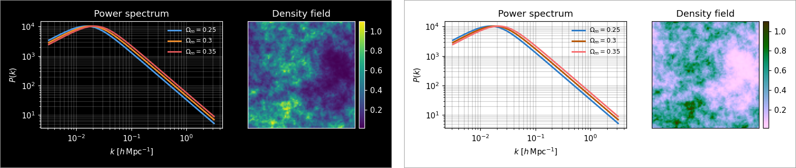

# Albedo

Flip plots between dark and light backgrounds while **keeping their hues**: blue stays blue, orange stays orange. Use it to move a figure from a dark talk slide into a light paper, or the other way round, without re-plotting.



A plain colour invert turns blue into orange and yellow into blue. Albedo inverts and then rotates every hue back by 180°, so only light and dark swap. The default mode is the same maths as the CSS filter `invert(1) hue-rotate(180deg)`, so flipped figures match web pages and slides that use that filter.

Albedo comes in three forms:

- **A Python package** that recolours matplotlib figures directly, so flipped PDFs and SVGs stay vector.
- **A command-line tool** for image and PDF files.
- **A web app** (`index.html`) for flipping one-off files in the browser.

## Install

Albedo needs Python 3.9 or later.

```bash
git clone <this repository> albedo      # or use your existing copy
pip install -e "albedo[all]"
```

`[all]` adds matplotlib (for figures) and PyMuPDF (for PDF files). The core only needs NumPy and Pillow; install `albedo[mpl]` or `albedo[pdf]` to add just one of them.

## Quick start

```python
import matplotlib.pyplot as plt
import albedo

plt.style.use("dark_background")
fig, ax = plt.subplots()
ax.plot(x, y)

light = albedo.flip_figure(fig)            # flipped copy; fig is untouched
light.savefig("plot_paper.pdf")            # still a vector PDF

albedo.compare(fig)                        # original and flipped side by side
albedo.savefig_pair(fig, "plot.pdf")       # writes plot.pdf and plot_inverted.pdf
```

From a terminal:

```bash
albedo plot.png                            # -> plot_inverted.png
albedo figure.pdf --dpi 300                # -> figure_inverted.pdf
```

`demo.ipynb` walks through every feature with worked examples. It's saved with its outputs, so you can read it on GitHub without running it.

## Python API

| Function | What it does |
|---|---|
| `flip_figure(fig, inplace=False, **opts)` | Recolours a matplotlib figure and returns the flipped copy (or `fig` itself with `inplace=True`). |
| `compare(fig, dpi=120, show=True, **opts)` | Shows the original and flipped figure side by side; returns the comparison figure. |
| `savefig_pair(fig, path, suffix="_inverted", flip_opts=None, **savefig_kw)` | Saves the figure and its flipped copy; returns both paths. |
| `flip_image(img, **opts)` | Flips a NumPy array or PIL image and returns the same type. |
| `flip_file(src, dst=None, dpi=300, **opts)` | Flips an image or PDF file on disk; returns the output path. |
| `flip_color(color, **opts)` | Flips one matplotlib colour spec; returns an RGBA tuple. |
| `flip_rgb(rgb, **opts)` | The core transform on float RGB values in 0–1, shape `(..., 3)`. |

### Options

Every function takes the same keyword options:

| Option | Default | Meaning |
|---|---|---|
| `mode` | `"css"` | `"css"` matches the browser filter exactly; `"oklab"` flips *perceived* lightness in the OKLab colour space and keeps hue and saturation more faithfully. |
| `hue` | `0` | Extra hue rotation in degrees after the flip. `0` keeps every hue. |
| `black` | `"#000000"` | Darkest output colour. Set it to your slide background so a flipped figure blends in. |
| `white` | `"#ffffff"` | Lightest output colour. |

Colours can be hex strings, names (`"navy"`; matplotlib names such as `"tab:blue"` and `"C0"` when matplotlib is installed), or RGB tuples in 0–1 (or 0–255).

```python
albedo.flip_figure(fig, mode="oklab", black="#0c0d12", white="#e8e6df")
```

### What `flip_figure` recolours

Lines and markers; text, titles, tick labels, legends and text boxes; patches such as bars, histograms, fills, arrows, spines and backgrounds; collections such as scatter, error bars and contours; colour-mapped artists (`imshow`, `pcolormesh`, `scatter(c=...)`, `contourf`) along with their colorbars; and RGB images.

The flipped copy is an ordinary matplotlib figure, so you can keep editing it. It saves with its own flipped background even when a style sheet such as `dark_background` has fixed `savefig.facecolor`.

### Images and arrays

`flip_image` accepts:

- **NumPy arrays:** greyscale `(H, W)`, RGB `(H, W, 3)` or RGBA `(H, W, 4)`. Integer arrays use their type's full range (uint8 0–255, uint16 0–65535) and keep their type; float arrays are read as 0–1.
- **PIL images:** any mode. They come back as 8-bit RGB, or RGBA if the input had transparency.

Transparency is always kept. Greyscale input comes back as RGB, because a hue shift or output range can add colour.

## Command line

```text
albedo [-h] [--mode {css,oklab}] [--hue HUE] [--black BLACK] [--white WHITE]
       [--dpi DPI] [-o OUTDIR] [--suffix SUFFIX] inputs [inputs ...]
```

| Flag | Default | Meaning |
|---|---|---|
| `--mode` | `css` | `css` or `oklab` |
| `--hue` | `0` | extra hue shift in degrees |
| `--black`, `--white` | `#000000`, `#ffffff` | output range |
| `--dpi` | `300` | resolution for rasterising PDF pages |
| `-o`, `--outdir` | next to each input | output folder |
| `--suffix` | `_inverted` | added to each output file name |

```bash
albedo figs/*.png --mode oklab --black '#0c0d12' -o figs/dark/
```

The command flips every file it can, reports any it couldn't on stderr, and exits with status 1 if any failed. It refuses to overwrite its input.

## Web app

Open `index.html` in a browser. Drop in, paste or open an image or PDF, adjust the settings (mode, hue shift, output range, PDF resolution, output format and quality), and download the result as PNG, JPEG, WebP or PDF. It has a light/dark toggle, handles multi-page PDFs, and processes files in your browser without uploading them.

The page loads its PDF reader and writer (pdf.js, jsPDF) and its fonts from public CDNs. Images still work offline; PDFs need an internet connection.

## How it works

**`css` mode** inverts each colour (`1 − rgb`) and then applies the Filter Effects spec's `hue-rotate(180°)` matrix. That matrix keeps brightness fixed and turns hue by 180°, which cancels the hue flip caused by inverting. Brightness flips and hue stays put.

**`oklab` mode** converts to [OKLab](https://bottosson.github.io/posts/oklab/), a colour space built so that distances match how different colours look. It replaces the lightness `L` with `1 − L` and converts back. Hue and saturation are untouched, and greys flip by how bright they *look* rather than by their pixel value.

**Output range:** after the flip, each colour `c` is mapped to `black + c × (white − black)`.

## Limitations

- **Flipping twice is not an exact undo.** Both transforms are their own inverse on paper, but screens can't show every colour at every brightness: there is no very dark, fully saturated yellow, for example. Flipped colours outside the displayable range get clipped, and a second flip can't recover what was clipped. Greys always round-trip exactly. Keep your original figure or script rather than flipping a flipped figure back.
- **Colormaps flip too.** A flip keeps the light-to-dark ordering readable, but a named colormap like viridis comes out as a different-looking map. To keep one exactly, re-apply it after flipping: `light.axes[0].images[0].set_cmap("viridis")`. The colorbar follows the image.
- **Mid-greys barely change.** Anything close to 50% lightness looks about the same after a flip, so it may lose contrast against the new background.
- **Draw-time artists aren't reached.** `flip_figure` recolours what the figure contains. Anything created only while drawing (custom draw callbacks, some third-party artists) is out of reach; for those, save the figure and use `flip_image` or `flip_file`.
- **PDF files are rasterised.** `flip_file` and the web app turn PDF pages into images at the chosen DPI. For vector output, flip the matplotlib figure instead.
- **Unpicklable figures.** `flip_figure` copies a figure by pickling it. If something in the figure can't be pickled, use `inplace=True`.
- **8-bit output from PIL.** PIL images, including 16-bit PNG files read through `flip_file`, come back as 8-bit. Pass a uint16 NumPy array to `flip_image` to keep 16 bits.

## Development

```bash
pip install -e ".[dev]"
pytest                       # test suite
ruff check albedo.py tests   # lint
```

Tests run on GitHub Actions for Python 3.9 and 3.12 on Linux and macOS (`.github/workflows/tests.yml`).

## License

MIT; see [LICENSE](LICENSE).
